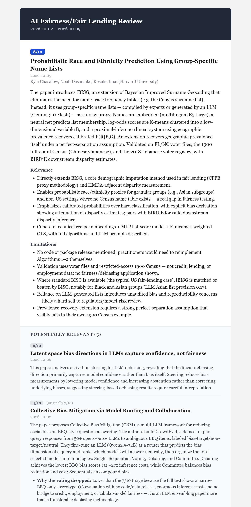
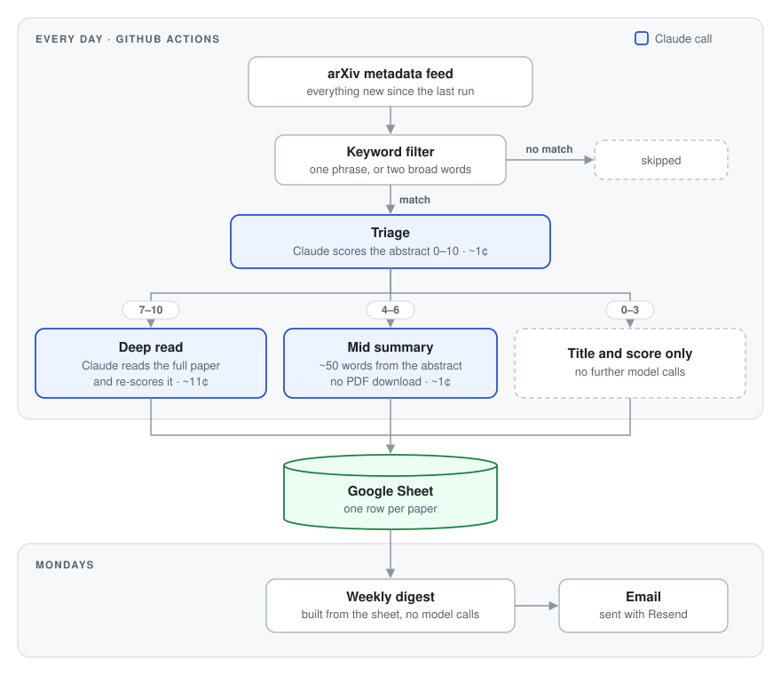
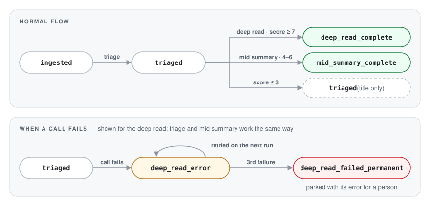

# lit_pipeline

**A research assistant that reads arXiv every day and sends a digest of what's worth reading.**

Each day it finds the new arXiv papers that match a topic, has Claude score
every abstract against a plain-English description of what matters, reads the
full text of the strongest candidates, and writes up what each one does, why
it's relevant and what limits its practical use. Every Monday the results
arrive as one email.

It was built to follow fair lending and algorithmic fairness research, a
niche no off-the-shelf alert covers well. It runs unattended on GitHub
Actions, keeps all of its state in a single Google Sheet, and costs about $1
a week in API calls. Pointing it at a different field means rewriting one
paragraph and a keyword list.

## What arrives every Monday

<p align="center">
  
</p>

A real digest, cropped. The top card is a **deep read**: Claude read the
whole paper and wrote the summary, the relevance to the stated interests and
the practical limitations. Below it are **potentially relevant** papers,
summarized from the abstract alone. The second of those scored 7/10 from its
abstract, so it got a deep read. The full text didn't hold up and it dropped
to 4/10, with the reason shown. The rest of the email lists every other paper
reviewed that week and what the week cost.

## How it works

<p align="center">
  
</p>

1. **Harvest.** Pull every arXiv record added since the last successful run
   and keep the ones whose abstracts match the keyword lists.
2. **Triage.** Claude scores each abstract from 0 to 10 against the
   interests text, with a one-line rationale.
3. **Route.** Papers scoring 7 or more get a deep read. Papers scoring 4 to 6
   get a short summary of the abstract. Everything else is kept with just its
   title and score. Both cutoffs are configurable.
4. **Deep read.** Download the PDF, extract the text, cut it at the
   References, and have Claude write a structured summary, relevance and
   limitations, list the authors' institutions, and give its own score.
5. **Digest.** On Mondays, render the week's papers from the sheet into an
   HTML email. This step is plain templating with no model calls, so the
   email is predictable and free to rebuild.

## Key design decisions

### Read the abstract first, and the paper only when it earns it

Scoring an abstract costs about a cent. A deep read costs about ten times as
much, since it sends the whole paper. So the full read is reserved for papers
that clear the triage bar.

The deep read is also allowed to overrule triage. Once Claude has read the
whole paper, its score replaces the abstract-only score. A paper that drops
out of the top tier isn't lost: it moves to the mid tier with its deep-read
summary and a sentence on why the rating fell, without another model call.
The original abstract score is kept in its own column, so the two can be
compared.

### A Google Sheet is the whole database

Every paper is one row. Each stage writes its result, token counts and cost
as columns on that row, so everything known about a paper is in one place,
sortable and filterable, with no server to run. The sheet is easy to read,
fix by hand or share. For one person's literature feed, nothing more is
needed.

A `status` column is the pipeline's only state machine:

<p align="center">
  
</p>

Each run picks up whatever isn't finished, so an interrupted run is fixed by
running it again. A failed step is retried on later runs. After its third
failure the paper is parked, with its error message, for a person to look
at. The only other state is one date: the last day the harvest fully
covered. If arXiv is down, the next run starts from that date and catches
up, so no papers are lost.

### Harvest arXiv's metadata feed instead of searching it

The daily run started out on arXiv's search API. That API rate-limits each IP
address, and GitHub's shared runners were often refused on their very first
request. The daily job now uses OAI-PMH, arXiv's bulk metadata feed, which is
designed for this kind of harvesting. It takes everything changed since the
last run and filters locally.

The local filter has two lists. Specific phrases ("fair lending", "disparate
impact", "Bayesian Improved Surname Geocoding") include a paper on their own.
Broad words ("fairness", "bias", "discrimination", "credit") only count when
two of them appear together, because "discrimination" on its own is everyday
vocabulary in physics and statistics.

### Send Claude text, not the PDF, and stop at the References

Claude can read PDFs natively, figures and layout included, but that took
about 59K input tokens per paper. For a summary of what a paper does, the
extracted text is enough. The bibliography adds tokens without adding
anything to a summary, so the text is cut at the References heading, which
also drops any appendix after it. A 50-page cap catches the rare document
where that heading can't be trusted. When a 257-page thesis matched the
keywords, this brought its deep read from about $2.00 to about $0.25.

### Get structured output, validated on arrival

Each step's output is defined as a Pydantic model. The Anthropic SDK sends
its JSON Schema with the request and hands back a validated object, so there
is no free-text parsing. Scores are clamped to 0–10 regardless. A small
cleanup pass undoes double-escaped characters, which the deep-read model
occasionally writes inside its own JSON.

### Measure cost instead of guessing it

Every row records the tokens and dollars spent at each stage, and every
digest reports the cost of its week. Before an expensive manual run, a dry
run projects the deep-read cost from the sheet's own historical average, so
the estimate stays accurate as prompts, models and paper mix change.

### Choose models by experiment

Before changing models, the production prompts were run on four Claude models
(Haiku 4.5, Sonnet 5.5, Opus 5.5 and Fable 5.1) over the same papers. Every
number, named entity and scope claim in the deep reads was then checked
against the paper text. Haiku invented specific figures. Opus 5.5's only slip
was one accurate detail it knew from outside the paper. It also framed the
lending-law issues most sharply, and its deep reads cost 26% less than those
of the Opus 5 model it replaced. Triage and deep read now both run on Opus
5.5. The write-up is in
[`analysis/model_comparison/review.md`](analysis/model_comparison/review.md).

## Beyond the daily run

Two manual commands reuse the same pipeline stages.

### Backfill a past date range

```bash
uv run lit-backfill --start-date 2024-01-01 --end-date 2024-01-31 --dry-run
uv run lit-backfill --start-date 2024-01-01 --end-date 2024-01-31
```

The first command searches the window, triages and summarizes what it finds,
then stops before any deep reads. It prints a score histogram and a
projected cost for the deep reads. The second runs everything and emails a
digest for that window. Re-running is safe, because finished papers are
skipped, so a dry run can be followed by the real run at no extra cost.

| Flag | Effect |
|---|---|
| `--start-date`, `--end-date` | Required, inclusive, `YYYY-MM-DD`. Matched against each paper's arXiv publish date. |
| `--query "..."` | Search these phrases instead of `arxiv.specific_keywords` (repeatable). |
| `--threshold N` | Override the deep-read cutoff for this run. |
| `--dry-run` | Stop after triage and mid summaries: no deep reads, no email. |

Backfills use arXiv's search API, which won't page past 10,000 results for
one query. With the standing keyword lists, a month at a time stays well
under that limit, but all of 2024 at once does not.

### Deep-dive specific papers

```bash
uv run lit-deep-dive 2501.12345 arXiv:2502.09876v2 https://arxiv.org/abs/2503.01234
```

This forces named papers through triage and a deep read, whatever they score
and whether or not the keywords would have found them. It's useful when a
colleague sends a paper, or when the pipeline's 3/10 looks wrong. IDs are
accepted in any common form (versioned, prefixed, pasted URLs, pre-2007
style), and anything unrecognizable is rejected before any money is spent.

| Flag | Effect |
|---|---|
| `--dry-run` | Triage only, plus a projected deep-read cost. |
| `--no-email` | Store the results in the sheet without sending the report. |
| `--refresh` | Re-read papers that already have a deep read. Without it they're reused for free. |
| `--attach-pdfs` | Attach one PDF per paper: the write-up as page 1, the paper after it. |

With `--attach-pdfs`, a batch that would exceed Resend's 40 MB email limit is
split across numbered emails, each carrying the full report. Papers pulled in
this way that the keyword lists would never have matched are flagged
`manual_only`, so they and their cost stay out of the weekly digest.

## Cost

At September 2026's volume (66 papers triaged, 27 deep-read), the pipeline
costs roughly $4 a month on Opus 5.5. That's about $0.01 per triage and about
$0.11 per deep read, though a deep read's cost varies with the length of the
paper. Exact per-paper costs are in the sheet.

## Repository layout

```
config/settings.yaml           interests, keywords, thresholds, models
src/lit_pipeline/
  daily_pipeline.py            lit-daily: harvest, triage, summarize, deep-read
  weekly_report.py             lit-weekly: build and send the digest
  backfill.py                  lit-backfill
  manual_deep_dive.py          lit-deep-dive
  pipeline_stages.py           the triage, mid-summary and deep-read stages shared by all of the above
  arxiv_client.py              OAI-PMH harvest, search API, keyword filter, PDF download
  pdf_extract.py               text extraction and References trimming
  llm_triage.py                the Claude calls, one module per step
  llm_mid_summary.py
  llm_deep_read.py
  schemas.py                   Pydantic schemas for each step's output
  sheets_store.py              the Google Sheet as a database
  reporting.py, templates/     digest assembly and HTML templates
  pdf_bundle.py                write-up + paper PDFs for --attach-pdfs
  email_resend.py              email delivery
  pricing.py                   per-model token prices
analysis/model_comparison/     the model experiment and its write-up
.github/workflows/             the daily schedule and the manual digest button
```

## Running your own

Setup takes about half an hour across four free or cheap accounts: Anthropic,
Google Cloud, Resend and GitHub. See [`docs/setup.md`](docs/setup.md).
